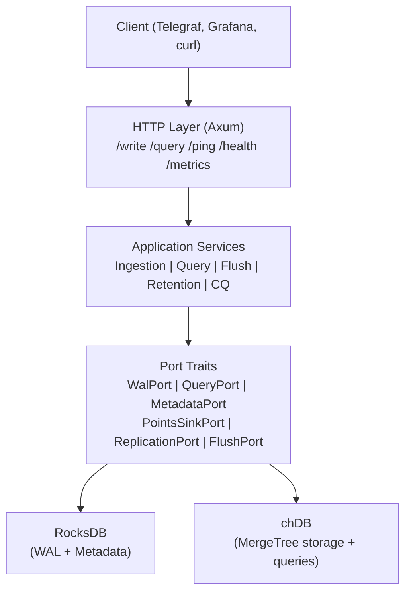
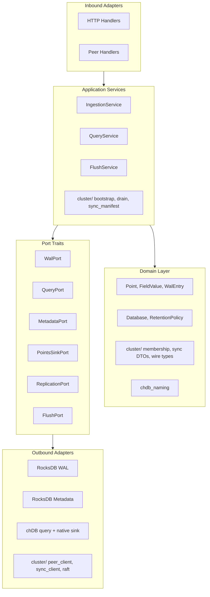
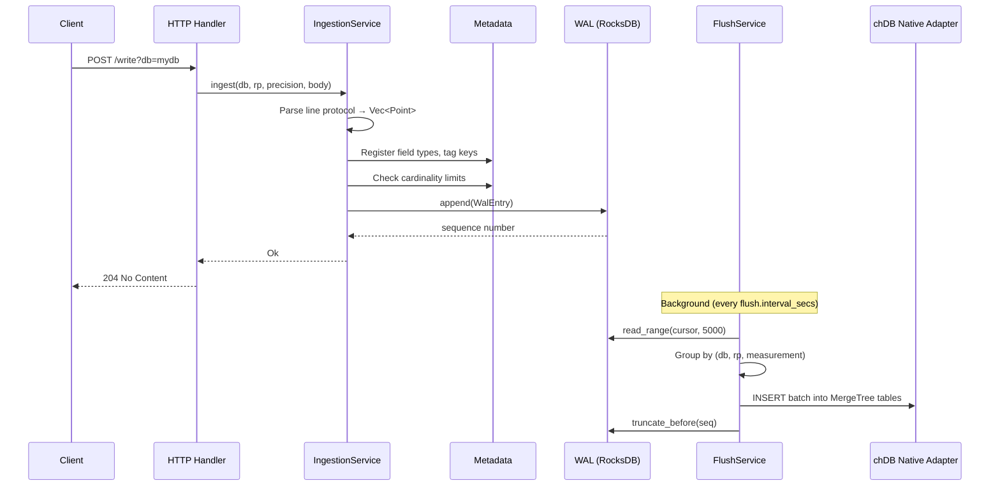
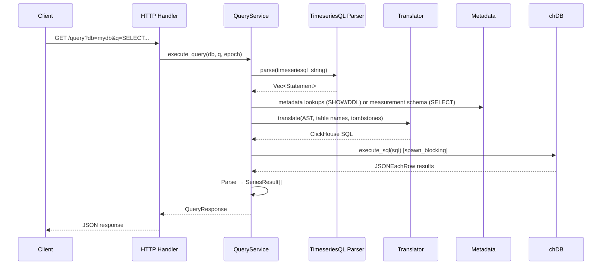

# Architecture

HyperbyteDB uses embedded chDB MergeTree tables as the sole time-series storage backend. The source tree follows strict hexagonal layering under `domain/`, `ports/`, `application/`, and `adapters/`.

HyperbyteDB is a time-series database that combines RocksDB (WAL/metadata) and embedded ClickHouse (chDB) for queries and native storage.

---

## System Overview

**RocksDB** provides the WAL (durable, ordered write log) and metadata store (databases, measurements, schemas, users, tombstones, CQ definitions).

**chDB** (embedded ClickHouse) is both the query engine and the storage backend. Influx-compatible TimeseriesQL is transpiled to ClickHouse SQL; flushed WAL batches are inserted into per-measurement `ReplacingMergeTree` tables under `chdb.session_data_path`.

---

## Hexagonal Architecture (Ports and Adapters)

HyperbyteDB uses the hexagonal pattern. Business logic depends only on port traits, never on concrete implementations.

This means:
- Swapping RocksDB for another WAL requires only implementing `WalPort`.
- Swapping chDB for another SQL engine requires only implementing `QueryPort` and `PointsSinkPort`.
- Cluster outbound I/O is isolated in `adapters/cluster/`; application services use `ReplicationPort` and `FlushPort` rather than concrete HTTP clients.
- The HTTP layer can be replaced without touching business logic.

---

## Data Flow

### Write Path

In cluster mode, `PeerIngestionService` fans out replicated line protocol via `ReplicationPort` after the local WAL append.

### Read Path

---

## Component Summary

| Component | Location | Purpose |
|-----------|----------|---------|
| **CLI / Main** | `src/main.rs` | Entry point, clap CLI, server lifecycle, graceful shutdown |
| **Bootstrap** | `src/bootstrap.rs` | Composition root: wires all adapters and services |
| **Config** | `src/config.rs` | Figment-based config loading (TOML + env vars) |
| **Domain** | `src/domain/` | Pure types: Point, Database, WalEntry, cluster DTOs, `chdb_naming` |
| **Ports** | `src/ports/` | Trait boundaries: WAL, metadata, query, ingestion, auth, replication, flush |
| **Application** | `src/application/` | Business logic: ingestion, query, flush, retention, replication apply |
| **Application / cluster** | `src/application/cluster/` | Cluster orchestration: bootstrap, drain, heartbeat, sync manifest builder |
| **TimeseriesQL** | `src/timeseriesql/` | Influx-compatible parser, AST, ClickHouse translator |
| **HTTP Adapters** | `src/adapters/http/` | Axum handlers, router, middleware, auth |
| **chDB Adapters** | `src/adapters/chdb/` | Query adapter, native flush adapter (`PointsSinkPort`), shared session |
| **Cluster Adapters** | `src/adapters/cluster/` | Peer client, sync client, replication log, hinted handoff, Raft I/O |

---

## Key Design Patterns

| Pattern | Where Used |
|---------|------------|
| **Ports and adapters** | All business logic depends on port traits, not concrete implementations |
| **Composition root** | `bootstrap::build_services` wires everything together |
| **Decorator / wrapper** | `BatchingWal` wraps `RocksDbWal` for group commit |
| **Strategy** | `IngestionServiceImpl` vs `PeerIngestionService` |
| **Facade** | `QueryServiceImpl` over parser + transpiler + metadata + chDB |
| **Worker pool + channel** | `ReplicationApplyQueue`, `PeerClient` outbound loop |
| **Cache** | Ingest schema cache, metadata measurement cache, auth verification cache |
| **Consensus** | OpenRaft for schema/coordination only; HTTP transport |

---

## See Also

- [Core Modules](internals/core-modules.md) — Detailed source code walkthrough
- [Key Design Decisions](internals/key-design-decisions.md) — Deep dives into subsystems
- [Extension Points](internals/extension-points.md) — How to add new functionality
