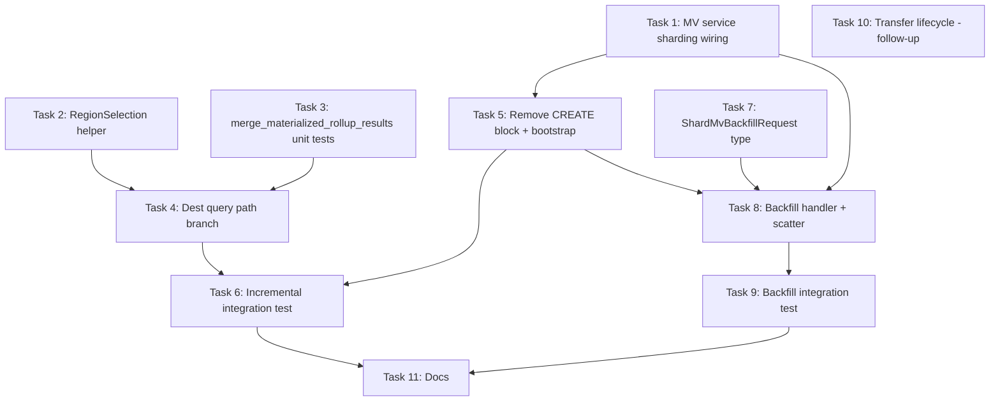

# Sharded Materialized Views Implementation Plan

> **For agentic workers:** REQUIRED SUB-SKILL: Use superpowers:subagent-driven-development (recommended) or superpowers:executing-plans to implement this plan task-by-task. Steps use checkbox (`- [ ]`) syntax for tracking.

**Goal:** Enable incremental ClickHouse materialized views when series sharding is enabled, with per-node MV triggers, scatter-gather backfill, and rollup-aware dest query merge.

**Architecture:** Keep existing dual ClickHouse MV objects (fact + series) per node. Source writes are already region-scoped by `series_id` routing, so local MV triggers are correct. Dest measurements store region-local partial rollups; coordinators query **all dest regions** and merge with SummingMergeTree semantics. Historical backfill is scattered per source region via a new internal HTTP endpoint.

**Tech Stack:** Rust, embedded chDB (ClickHouse), RocksDB metadata, Raft schema mutations, existing shard scatter helpers.

## Global Constraints

- Do not change TimeseriesQL MV syntax or `MaterializedViewDef` schema
- Non-sharded MV behavior must remain unchanged (zero regression)
- Incremental refresh stays ClickHouse-native (no CQ rewrite)
- Dest measurements remain write-protected (`MeasurementMeta.materialized = true`)
- Region transfer lifecycle deferred to follow-up PR (Task 10)

---

## Plan Review (Pre-Implementation)

### Strengths

- Correctly identifies root cause: local MV triggers are fine; backfill and dest reads are broken
- Reuses existing MV translation, Raft replication, and shard scatter patterns
- Incremental model matches user preference and existing non-sharded design

### Issues Found (Fixed in Task Order Below)

| Issue | Fix |
|-------|-----|
| **Original phase order puts CREATE before dest merge** | Dest query merge (Task 3–4) must land before enabling CREATE (Task 5); otherwise incremental MV writes succeed but SELECT is wrong |
| **`QueryServiceImpl` owns a separate `MaterializedViewService`** from `AppState.mv_service` | Task 1 adds `MaterializedViewService::with_sharding()` and propagates from `QueryServiceImpl::with_sharding()` |
| **Test harness creates MV service without sharding** | Task 5 updates `tests/common/sharding_cluster.rs` |
| **Backfill race not specified** | Task 8 runs scatter backfill **before** installing MV DDL on leader; followers never backfill (Raft reconcile skips it) |
| **`merge_materialized_rollup_results` signature unspecified** | Task 3 defines it to consume `MeasurementMeta.field_rollups` / `mean_fields`, not `SelectStatement` |
| **Aggregated SELECT on dest** (e.g. `SELECT mean(x) FROM dest`) | Task 4 uses materialized merge for raw rows, then existing `merge_sharded_query_results` if query has aggregates |

### Dependency Graph



---

## File Map

| File | Responsibility |
|------|----------------|
| [`materialized_view_service.rs`](hyperbytedb/src/application/materialized_view_service.rs) | Sharding context, dest bootstrap, backfill orchestration |
| [`query_service.rs`](hyperbytedb/src/application/query_service.rs) | Remove CREATE block; dest query branch |
| [`query_merge.rs`](hyperbytedb/src/domain/sharding/query_merge.rs) | `merge_materialized_rollup_results` |
| [`shard_query_routing.rs`](hyperbytedb/src/application/shard_query_routing.rs) | `select_regions_for_materialized_dest()` |
| [`sharded_mv_backfill.rs`](hyperbytedb/src/application/sharded_mv_backfill.rs) | **New** — scatter backfill orchestration |
| [`domain/sharding/types.rs`](hyperbytedb/src/domain/sharding/types.rs) | `ShardMvBackfillRequest` |
| [`shard_handlers.rs`](hyperbytedb/src/adapters/http/shard_handlers.rs) | `handle_shard_mv_backfill` |
| [`router.rs`](hyperbytedb/src/adapters/http/router.rs) | Route registration |
| [`bootstrap.rs`](hyperbytedb/src/bootstrap.rs) | Wire sharding into AppState MV service |
| [`tests/common/sharding_cluster.rs`](hyperbytedb/tests/common/sharding_cluster.rs) | Test harness wiring |
| [`tests/sharding_mv_integration.rs`](hyperbytedb/tests/sharding_mv_integration.rs) | **New** — integration tests |

---

### Task 1: Wire Sharding Context into MaterializedViewService

**Files:**
- Modify: [`hyperbytedb/src/application/materialized_view_service.rs`](hyperbytedb/src/application/materialized_view_service.rs)
- Modify: [`hyperbytedb/src/application/query_service.rs`](hyperbytedb/src/application/query_service.rs) (`with_sharding`)
- Modify: [`hyperbytedb/src/bootstrap.rs`](hyperbytedb/src/bootstrap.rs)
- Modify: [`hyperbytedb/src/application/mod.rs`](hyperbytedb/src/application/mod.rs) (if new module added later)

**Interfaces:**
- Produces:
  ```rust
  impl MaterializedViewService {
      pub fn with_sharding(
          mut self,
          ctx: Arc<ShardRoutingContext>,
          is_leader: Arc<dyn Fn() -> bool + Send + Sync>,
          leader_addr: Arc<dyn Fn() -> Option<String> + Send + Sync>,
      ) -> Self;
  }
  ```
- Consumes: `ShardRoutingContext`, `ensure_measurement_bootstrapped` (used in Task 5)

- [x] **Step 1:** Add optional fields to `MaterializedViewService`:
  ```rust
  shard_routing: Option<Arc<ShardRoutingContext>>,
  is_raft_leader: Option<Arc<dyn Fn() -> bool + Send + Sync>>,
  raft_leader_addr: Option<Arc<dyn Fn() -> Option<String> + Send + Sync>>,
  ```
- [x] **Step 2:** Implement `with_sharding()` builder; default `None` preserves non-sharded behavior
- [x] **Step 3:** In `QueryServiceImpl::with_sharding`, after setting `self.shard_routing`, clone context into `self.mv_service`:
  ```rust
  pub fn with_sharding(mut self, ctx: Arc<ShardRoutingContext>) -> Self {
      self.shard_routing = Some(ctx.clone());
      Arc::make_mut(&mut self.mv_service) // if Arc — or store mv_service as mutable Arc pattern
      // Prefer: change mv_service wiring to call mv_service.with_sharding on a rebuilt Arc
      self
  }
  ```
  **Note:** Since `mv_service` is `Arc<MaterializedViewService>`, use interior mutability or rebuild:
  ```rust
  let mv = MaterializedViewService::new(...).with_sharding(ctx.clone(), ...);
  self.mv_service = Arc::new(mv);
  ```
- [x] **Step 4:** In `bootstrap.rs`, after creating `shard_routing`, call `mv_service.with_sharding(...)` before `reconcile_all()`
- [x] **Step 5:** Run `cargo check -p hyperbytedb`

**Deliverable:** MV service can access shard map; no behavior change yet.

---

### Task 2: Region Selection Helper for Materialized Destinations

**Files:**
- Modify: [`hyperbytedb/src/application/shard_query_routing.rs`](hyperbytedb/src/application/shard_query_routing.rs)

**Interfaces:**
- Produces:
  ```rust
  pub fn select_regions_for_materialized_dest<'a>(
      space: &'a MeasurementShardSpace,
  ) -> RegionSelection<'a> {
      RegionSelection::All
  }
  ```
  (Thin wrapper now; documents intent; future hook for optimization.)

- [x] **Step 1:** Add function returning `RegionSelection::All`
- [x] **Step 2:** Add unit test confirming it always returns all regions regardless of WHERE clause
- [x] **Step 3:** Run `cargo test -p hyperbytedb shard_query_routing`

**Deliverable:** Explicit API for dest region fan-out.

---

### Task 3: merge_materialized_rollup_results (TDD)

**Files:**
- Modify: [`hyperbytedb/src/domain/sharding/query_merge.rs`](hyperbytedb/src/domain/sharding/query_merge.rs)
- Modify: [`hyperbytedb/src/domain/measurement.rs`](hyperbytedb/src/domain/measurement.rs) (import only)

**Interfaces:**
- Produces:
  ```rust
  pub fn merge_materialized_rollup_results(
      parts: Vec<QueryResponse>,
      meta: &MeasurementMeta,
  ) -> QueryResponse;
  ```
- Reuses private `merge_row` / `ColumnMerge` logic; builds rules from `meta.field_rollups` and `meta.mean_fields`

- [x] **Step 1: Write failing tests** in `query_merge.rs` `mod tests`:
  - Two partials with same `(name, tags, time)`, sum columns → summed
  - Two partials with mean storage (`sum_x`, `count_x`) → correct mean
  - Two partials with min/max → min/max respectively
  - Different tag sets → separate series (no merge)
- [x] **Step 2:** Run `cargo test -p hyperbytedb merge_materialized` — expect FAIL
- [x] **Step 3:** Implement `rollup_merge_rules(meta: &MeasurementMeta) -> HashMap<String, ColumnMerge>` mapping:
  - `RollupCombine::Sum` → `ColumnMerge::Sum`
  - mean fields → sum count columns separately; expose mean only when query asks (passthrough columns for now)
  - Non-rollup columns → `Passthrough` (must match across partials)
- [x] **Step 4:** Implement `merge_materialized_rollup_results` using same row-key logic as `merge_aggregate_parts` (`series_row_key` includes time)
- [x] **Step 5:** Run tests — expect PASS

**Deliverable:** Correct cross-region rollup merge for pre-materialized rows.

---

### Task 4: Branch execute_sharded_measurement_query for Materialized Dest

**Files:**
- Modify: [`hyperbytedb/src/application/query_service.rs`](hyperbytedb/src/application/query_service.rs)

**Interfaces:**
- Consumes: `merge_materialized_rollup_results`, `select_regions_for_materialized_dest`, `MeasurementMeta.materialized`

- [x] **Step 1:** In `execute_sharded_measurement_query`, after loading measurement meta, branch:
  ```rust
  let is_materialized_dest = meta.as_ref().map(|m| m.materialized).unwrap_or(false);
  let region_selection = if is_materialized_dest {
      select_regions_for_materialized_dest(space)
  } else {
      select_regions_for_query(space, measurement, &effective_stmt)
  };
  ```
- [x] **Step 2:** When building per-region SQL, skip `inject_region_series_id_predicate` if `is_materialized_dest`:
  ```rust
  let region_sql = if is_materialized_dest {
      sql.clone()
  } else {
      inject_region_series_id_predicate(sql.clone(), region.start, region.end)
  };
  ```
- [x] **Step 3:** After fan-out merge:
  ```rust
  let merged = if is_materialized_dest {
      let meta = meta.expect("materialized dest must have metadata");
      if select_has_true_aggregate(&effective_stmt) {
          // First merge partial materialized rows, then re-aggregate if query asks
          let combined = merge_materialized_rollup_results(parts, &meta);
          merge_sharded_query_results(vec![combined], &effective_stmt)
      } else {
          merge_materialized_rollup_results(parts, &meta)
      }
  } else {
      merge_sharded_query_results(parts, &effective_stmt)
  };
  ```
- [x] **Step 4:** Run `cargo test -p hyperbytedb query_merge` and existing sharding tests

**Deliverable:** Dest SELECT returns globally merged rollups across regions.

---

### Task 5: Enable CREATE MV + Dest Shard Bootstrap

**Files:**
- Modify: [`hyperbytedb/src/application/query_service.rs`](hyperbytedb/src/application/query_service.rs) — remove guard lines 1156–1160
- Modify: [`hyperbytedb/src/application/materialized_view_service.rs`](hyperbytedb/src/application/materialized_view_service.rs)
- Modify: [`hyperbytedb/tests/common/sharding_cluster.rs`](hyperbytedb/tests/common/sharding_cluster.rs)

**Interfaces:**
- Consumes: `ensure_measurement_bootstrapped`, sharding context from Task 1

- [x] **Step 1:** Delete CREATE MV sharding guard in `query_service.rs`
- [x] **Step 2:** Add private helper to `MaterializedViewService`:
  ```rust
  async fn bootstrap_sharded_measurements(
      &self,
      source_db: &str, source_rp: &str, source_measurement: &str,
      dest_db: &str, dest_rp: &str, dest_measurement: &str,
  ) -> Result<(), HyperbytedbError>;
  ```
  Calls `ensure_measurement_bootstrapped` for source and dest when `shard_routing` is `Some`
- [x] **Step 3:** Call from `create()` before `materialize_ddl()`
- [x] **Step 4:** When sharding enabled and `backfill_on_create`, skip local fact backfill in `materialize_ddl` (Task 8 will scatter); keep series backfill local-only for now OR skip until Task 8
- [x] **Step 5:** Update `sharding_cluster.rs` to build MV service with `.with_sharding(shard_routing.clone(), is_leader, leader_addr)`
- [x] **Step 6:** Run `cargo check -p hyperbytedb`

**Deliverable:** `CREATE MATERIALIZED VIEW` succeeds on sharded clusters; dest shard space exists.

---

### Task 6: Incremental MV Integration Test

**Files:**
- Create: [`hyperbytedb/tests/sharding_mv_integration.rs`](hyperbytedb/tests/sharding_mv_integration.rs)

- [x] **Step 1:** Add test module to `hyperbytedb/tests/integration.rs` or standalone binary (follow `sharding_cluster_integration.rs` pattern)
- [x] **Step 2:** Write `sharded_mv_incremental_rollup`:
  1. Start 3-node sharded cluster via `common::sharding_cluster`
  2. Force split into 2+ regions (enough writes with distinct tag sets)
  3. Write points to source measurement on different hosts
  4. `CREATE MATERIALIZED VIEW` (no BACKFILL): `SELECT mean("value") INTO "cpu_5m" FROM "cpu" GROUP BY time(1m), *`
  5. Write additional points
  6. Flush WAL on all nodes
  7. `SELECT mean("value") FROM "cpu_5m"` — assert globally correct mean per host
- [x] **Step 3:** Write `sharded_mv_drop` — CREATE then DROP; verify dest tables gone on all nodes
- [x] **Step 4:** Run `cargo test -p hyperbytedb sharded_mv -- --test-threads=1`
- [x] **Step 5:** Run existing `cargo test -p hyperbytedb test_materialized_view_replicates_to_peer` — non-sharded regression

**Deliverable:** Incremental sharded MV proven end-to-end.

---

### Task 7: ShardMvBackfillRequest Domain Type

**Files:**
- Modify: [`hyperbytedb/src/domain/sharding/types.rs`](hyperbytedb/src/domain/sharding/types.rs)
- Modify: [`hyperbytedb/src/domain/sharding/mod.rs`](hyperbytedb/src/domain/sharding/mod.rs)

**Interfaces:**
- Produces:
  ```rust
  #[derive(Debug, Clone, Serialize, Deserialize)]
  pub enum MvBackfillPhase {
      Fact,
      Series,
  }

  #[derive(Debug, Clone, Serialize, Deserialize)]
  pub struct ShardMvBackfillRequest {
      pub db: String,
      pub rp: String,
      pub epoch: ShardEpoch,
      pub region_id: u64,
      pub phase: MvBackfillPhase,
      pub sql: String,
  }
  ```

- [x] **Step 1:** Add types and export from `mod.rs`
- [x] **Step 2:** `cargo check -p hyperbytedb`

**Deliverable:** Request type for backfill scatter endpoint.

---

### Task 8: Sharded Backfill Scatter

**Files:**
- Create: [`hyperbytedb/src/application/sharded_mv_backfill.rs`](hyperbytedb/src/application/sharded_mv_backfill.rs)
- Modify: [`hyperbytedb/src/adapters/http/shard_handlers.rs`](hyperbytedb/src/adapters/http/shard_handlers.rs)
- Modify: [`hyperbytedb/src/adapters/http/router.rs`](hyperbytedb/src/adapters/http/router.rs)
- Modify: [`hyperbytedb/src/adapters/cluster/peer_client.rs`](hyperbytedb/src/adapters/cluster/peer_client.rs) (add `post_shard_mv_backfill`)
- Modify: [`hyperbytedb/src/application/materialized_view_service.rs`](hyperbytedb/src/application/materialized_view_service.rs)

**Interfaces:**
- Produces:
  ```rust
  pub async fn scatter_mv_backfill(
      ctx: &ShardRoutingContext,
      source_db: &str,
      source_rp: &str,
      source_measurement: &str,
      fact_sql_template: &str,
      series_sql_template: &str,
      space: &MeasurementShardSpace,
  ) -> Result<(), HyperbytedbError>;
  ```

- [x] **Step 1:** Implement `handle_shard_mv_backfill` — validate epoch, execute `req.sql` via `query_port`, return 204
- [x] **Step 2:** Register `POST /internal/shard/mv-backfill` in router (same auth/middleware as other shard routes)
- [x] **Step 3:** Implement `scatter_mv_backfill`:
  - For each region in source space
  - Inject `inject_region_series_id_predicate` into fact and series SQL
  - `scatter_to_region_peers` with `ScatterKind::Query` (or new `Backfill` kind if metrics needed)
- [x] **Step 4:** In `MaterializedViewService::create()` when sharding + `backfill_on_create`:
  1. Build fact/series backfill SQL (reuse `translate_materialized_view_backfill` / series select)
  2. Call `scatter_mv_backfill` **before** `CREATE MATERIALIZED VIEW` DDL
  3. Then run `materialize_ddl` with `backfill_on_create: false`
- [x] **Step 5:** Add metric `hyperbytedb_shard_mv_backfill_regions_total`
- [x] **Step 6:** `cargo check -p hyperbytedb`

**Deliverable:** `CREATE ... WITH BACKFILL` populates all source regions.

---

### Task 9: Backfill + Tag-Subset Integration Tests

**Files:**
- Modify: [`hyperbytedb/tests/sharding_mv_integration.rs`](hyperbytedb/tests/sharding_mv_integration.rs)

- [x] **Step 1:** `sharded_mv_backfill` — write historical source data across regions, CREATE WITH BACKFILL, assert dest values match direct rollup query
- [x] **Step 2:** `sharded_mv_tag_subset_group_by` — source with tags `host`, `rack`; MV `GROUP BY time(1m), host` only; verify cross-region partial merge
- [x] **Step 3:** `sharded_mv_raft_replicate` — CREATE on leader; assert follower has CH MV objects (`system.tables` check, pattern from `raft_integration.rs`)
- [x] **Step 4:** Run full `cargo test -p hyperbytedb sharded_mv -- --test-threads=1`

**Deliverable:** Backfill, tag-subset merge, and Raft convergence verified.

---

### Task 10: Region Transfer Dest Cleanup (Follow-Up PR)

**Files:**
- Modify: [`hyperbytedb/src/application/shard_transfer.rs`](hyperbytedb/src/application/shard_transfer.rs)
- Modify: [`hyperbytedb/src/application/materialized_view_service.rs`](hyperbytedb/src/application/materialized_view_service.rs)

- [x] **Step 1:** Add `MaterializedViewService::purge_dest_partials_for_source_range(db, source_meas, start, end)`
  - List MVs where `source_measurement` matches
  - Execute `ALTER TABLE dest DELETE WHERE series_id IN (...)` or time-bounded delete per dest schema
- [x] **Step 2:** Call from `drop_region_data` after source fact delete (transfer ACK phase)
- [x] **Step 3:** Optional: trigger targeted re-backfill on new region primary
- [x] **Step 4:** Integration test: split → transfer → verify dest not doubled

**Deliverable:** No stale dest partials after region transfer. **Can ship independently after Tasks 1–9.**

---

### Task 11: Documentation

**Files:**
- Modify: [`docs/deep-dive/deep-dive-clustering.md`](docs/deep-dive/deep-dive-clustering.md) — remove MV limitation bullet
- Modify: [`docs/user-guide/advanced-features.md`](docs/user-guide/advanced-features.md) — add "Materialized Views with Sharding" section

- [x] **Step 1:** Document semantics: partial per region, all-region dest reads, backfill scatter, transfer limitation until Task 10
- [x] **Step 2:** Add example CREATE MV on sharded cluster
- [x] **Step 3:** Update [`docs/glossary.md`](docs/glossary.md) if MV entry mentions sharding incompatibility

**Deliverable:** User-facing docs match implementation.

---

## Spec Coverage Checklist

| Requirement | Task |
|-------------|------|
| CREATE MV succeeds with sharding | Task 5 |
| Incremental rollup on write | Tasks 5–6 |
| Dest SELECT globally correct | Tasks 3–4, 6, 9 |
| WITH BACKFILL all regions | Tasks 7–9 |
| Raft DDL convergence | Task 9 |
| DROP MV | Task 6 |
| Non-sharded regression | Task 6 |
| Transfer lifecycle | Task 10 (follow-up) |
| Docs | Task 11 |

---

## Execution Options

**Plan saved to:** `docs/superpowers/plans/2026-08-10-sharded-materialized-views.md`

1. **Subagent-Driven (recommended)** — one subagent per task, review between tasks
2. **Inline Execution** — batch tasks with checkpoints in this session

Which approach?
